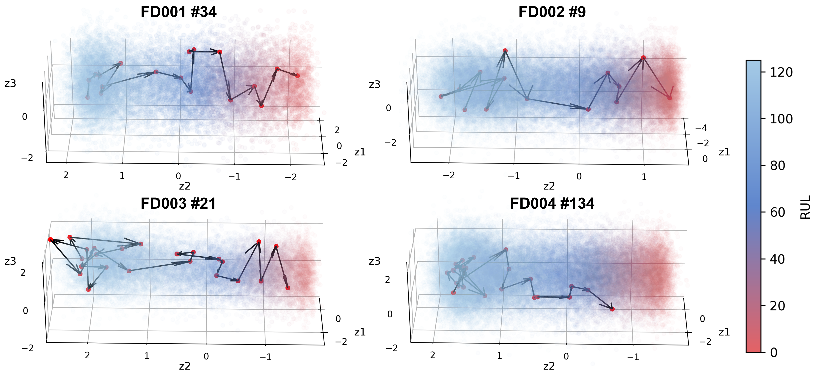

# RUL-FFVE

<p align="center">
      <a href="https://www.python.org/">
        </a>
       <a href= "https://pytorch.org/">
        </a>
       <a href= "https://github.com/LLerDagu/RUL-FFVE/blob/main/LICENSE">
        </a>
</p>

This is the official implementation for paper "Variational encoding based on factorized temporal-channel fusion and feature fusion for interpretable remaining useful life prediction"

Paper Link: [DOI: 10.1016/j.aei.2023.102316](https://doi.org/10.1016/j.aei.2023.102316)

The documentation is currently being updated.

## Abstract

We propose a Factorized temporal-channel fusion and Feature fusion based Variational Encoding (FFVE) for interpretable RUL prediction. By utilizing the factorization operation, we construct the Factorized Temporal-Channel Fusion (FTCF) block to learn temporal and channel dependencies, thereby reducing redundancy between channels. Through the feature fusion operations which mix original information with extracted feature information, we augment the original information that is lost during the deep network learning process, consequently avoiding performance degradation caused by increasing network depth. Through the above encoding process, sensor data is effectively compressed into a 3D latent space for predicting and interpreting the equipment degradation process.

## Requirements
Install Python>=3.7, PyTorch>=1.5.0.
```
matplotlib==3.5.2
numpy>=1.22.3
pandas>=1.4.3
scikit-learn>=1.0.2
imageio>=2.26.0
```

## Datasets
Download [C-MAPSS turbofan aircraft engine datasets](https://catalog.data.gov/dataset/c-mapss-aircraft-engine-simulator-data) and save to ./data folder.

You can either download the dataset from the official website or utilize the dataset that we have already downloaded for your convenience.

## Installation
```bash
git clone https://github.com/LLerDagu/RUL-FFVE.git
cd RUL-FFVE
pip install -r requirements.txt
```

## Visualization


The 3D latent representations of four train datasets for interpretable degenerate diagnosis. The figure shows the engine degradation routes learned by the FFVE under four working conditions.


The RUL degradation routes of engine unit in 3D Latent Space. The four test sub-datasets are shown. To facilitate observation, a prediction is made every 10 time steps.


For illustrative purposes, there are GIFs of the engine degradation route, which shows the rate of engine degradation as it changes with lifecycles.

## Citation
If you find this work helpful, please consider citing:
```
@article{CHEN2024102316,
title = {Variational encoding based on factorized temporal-channel fusion and feature fusion for interpretable remaining useful life prediction},
journal = {Advanced Engineering Informatics},
volume = {59},
pages = {102316},
year = {2024},
issn = {1474-0346},
doi = {https://doi.org/10.1016/j.aei.2023.102316},
author = {Yaning Chen and Dongsheng Liu and Xinyi Ding and Hongwei Jiang},
}
```

## Acknowledgement
We extend our gratitude to the following GitHub repositories for their invaluable codebase or datasets:
*   [Remaining-Useful-Life-Estimation-Variational](https://github.com/NahuelCostaCortez/Remaining-Useful-Life-Estimation-Variational)
*   [RUL-RVE-Pytorch](https://github.com/tjdhg456/RUL-RVE-Pytorch)
*   [MTS-Mixers](https://github.com/plumprc/MTS-Mixers)
*   [NASA](https://github.com/XiuzeZhou/NASA)
*   [PyTorch-VAE](https://github.com/AntixK/PyTorch-VAE)